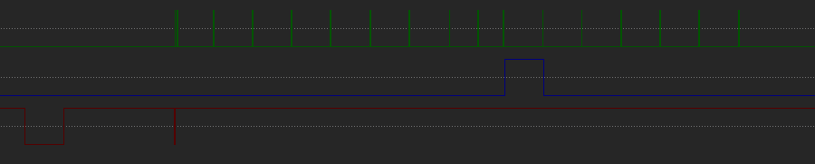
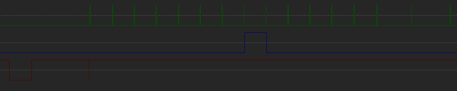

# General Information 
*note: The system of communication used is traditionally referred to as Master/Slave or Control/Target. The former is now deprecated and the latter is confusing, as the controller is the target and the Command Deck is the controller. For this reason I will just refer to them by their original names, Command Deck and Controller.*

The Rokenbok controller port is a female DB9 connector with only 5 pins in use, Ground, VCC, Serial Clock, Data Line, and a Chip Select line. 

This repo is using the Chip Select Line as a latch. The Data Line works one way, joystick to command deck. I believe the Command Deck can send information to the joystick using the Chip Select Line.

### Communication Protocol

The Command Deck will drive the Chip Select Line Low, signaling to the controller that it is ready to receive a command. The Deck will drive the serial clock High and then immediately back low. The deck will do this pulse 17 times. Each button is represented by one of the pulses. If that button is pressed the controller will drive the data line high until the next serial clock pulse. 

Essentially, this means the controller is sending over two bytes. These 2 bytes are represented on the data line. A pulse for a clock is 1 and no pulse is a 0. For example, 10000000 00000000 will have a data pulse on the first clock and nothing on the rest of them.

## Waveforms/Bytes
*note: the first Serial Clock pulse you see is actually two quick pulses in rapid sucession. The Select button goes inbetween these.*

### NO INPUT

Bytes: 00000000 00000000

### SELECT

Bytes: 10000000 00000000

Hex: 0x80 0x0

### A

Bytes: 00000000 01000000

Hex: 0x0 0x40

### B

Bytes: 00000000 00100000

Hex: 0x0 0x20

### X

Bytes: 00000000 00010000

Hex: 0x0 0x10

### Y

Bytes: 00000000 00000100

Hex: 0x0 0x4

### UP

Bytes: 00000100 00000000
Hex: 0x4 0x0

### DOWN

Bytes: 00000010 00000000

Hex: 0x2 0x0

### LEFT

Bytes: 00000000 10000000

Hex: 0x0 0x80

### RIGHT

Bytes: 00000001 00000000

Hex: 0x1 0x0
