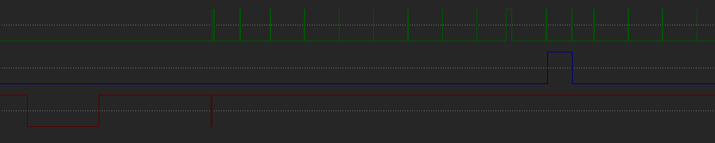
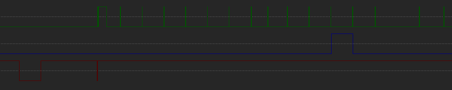
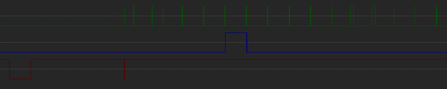
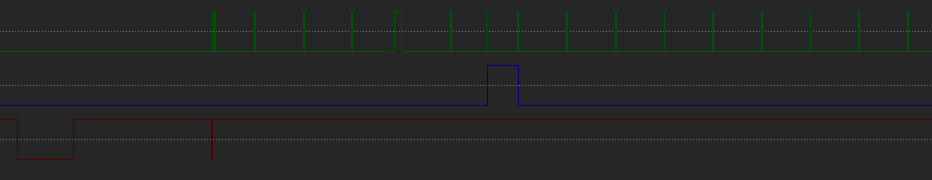

# General Information 
*note: The system of communication used is traditionally referred to as Master/Slave or Control/Target. The former is now deprecated and the latter is confusing as the Rokenbok controller is the target and the Command Deck is the controller. For this reason I will just refer to them by their original names, Command Deck and Controller.*

The Rokenbok controller port is a female DB9 connector with only 5 pins in use, Ground, VCC, Serial Clock, Data Line, and a Chip Select line. 

The Data Line works one way, controller to command deck. The Chip Select/Sel% functions well as a latch, but the Command Deck also be uses it to signal certain events to the controller, like when attempting to select a channel that another controller is already on.

Each Clock Cycle has 16 clocks. Each clock represents a button. If that button is pressed then the Controller will drive the Data line HIGH until the beginning of the next clock.

### Communication Protocol
From the start of a Clock Cycle:

1. Command Deck will drive the Sel% LOW, waits for a bit, then drive the Sel% HIGH again.
2. The Command Deck will again drive the Sel% LOW and the immmediately drives it HIGH again. This signals the start of the clocks to the controller
3. The Command Deck will begin pulsing the Clock HIGH and LOW. 
4. The Controller will drive the Data line HIGH or LOW for each Clock depending on the command it is issuing.

Through this process, the controller will send 2 bytes to the Command Deck. The Data line being driven HIGH for a clock reperesents a 1 and the being driven LOW for a 0.

For example, the Select button is represented by the first clock. If only the Select button is pressed then the controller will only drive the Data line HIGH for the first clock and LOW for the rest. The bytes sent will be 10000000 00000000.

## Waveforms/Bytes
*note: The first Serial Clock pulse you see is actually two quick pulses in rapid sucession. The Select button goes inbetween these.*

### NO INPUT

Bytes: 00000000 00000000

### SELECT

Bytes: 10000000 00000000

Hex: 0x80 0x0

### A

Bytes: 00000000 01000000

Hex: 0x0 0x40

### B

Bytes: 00000000 00100000

Hex: 0x0 0x20

### X

Bytes: 00000000 00010000

Hex: 0x0 0x10

### Y

Bytes: 00000000 00000100

Hex: 0x0 0x4

### UP

Bytes: 00000100 00000000
Hex: 0x4 0x0

### DOWN

Bytes: 00000010 00000000

Hex: 0x2 0x0

### LEFT

Bytes: 00000000 10000000

Hex: 0x0 0x80

### RIGHT

Bytes: 00000001 00000000

Hex: 0x1 0x0
